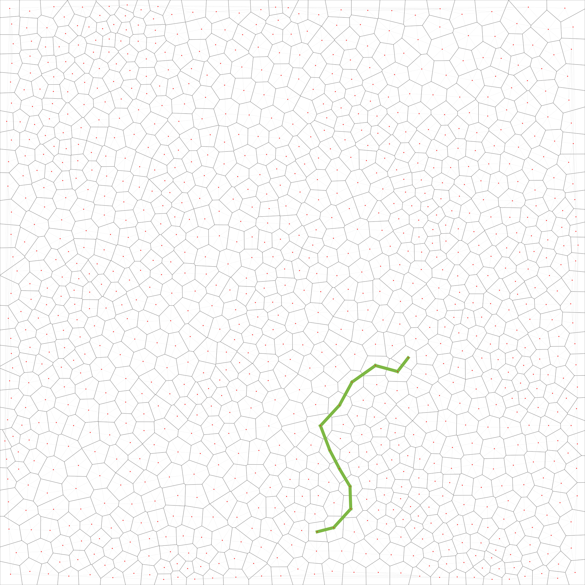

# Pathfinder (Assignment #4)

- Author: xiaotian lou

## How to install?

```
mosser@azrael A2 % mvn install
```

It creates jars:

1. `pathfinder/pathfinder.jar` to use as import as library found and return a edge list for the shortest path.
2. to use this lib, add as dependes import the Graph.*, create instance and use find ()
3. to get the Edge list for shortest path
```
        **Graph a = new Graph(nodeList);**
        **PathFinder pf = new DijkstraShortestPath(a);**
        **List<Edges> result = pf.find(start, end);**
```

## Examples of execution
### basic example find shortest path 

```
List<Nodes> nodeList = new ArrayList<>();
        Nodes start = new Nodes(0, 0, 14);
        Nodes end = new Nodes(100, 0, 14);
        Nodes middle1 = new Nodes(50, 100, 14);
        Nodes middle2 = new Nodes(49, 50, 14);
        start.getAdjacent().add(middle1);
        start.getAdjacent().add(middle2);
        middle1.getAdjacent().add(end);
        middle2.getAdjacent().add(end);

        nodeList.add(start);
        nodeList.add(end);
        nodeList.add(middle1);
        nodeList.add(middle2);

        **Graph a = new Graph(nodeList);**
        **PathFinder pf = new DijkstraShortestPath(a);**
        **List<Edges> result = pf.find(start, end);**

        for (Edges temp : result) {
            System.out.print(temp.getStart().getX()+"   ");
            System.out.println(temp.getStart().getY());
            System.out.print(temp.getEnd().getX()+"   ");
            System.out.println(temp.getEnd().getY());
        }
        
        //it found middle2 is the shortest path

```
### mesh example shortest path (connected to ADT) the result is in 

example graph:

```
        MeshADT meshADT1 = new MeshADT();//start adt
        String input_c = "..//IOArea\\inputoff.mesh";
        Structs.Mesh aMesh = new MeshFactory().read(input_c);
        meshADT1.readInputMesh(aMesh);
        
        
       //Preparation parameter of mesh adt to pathfinder
        List<Nodes> nodeList = new ArrayList<>();
        for (PolygonADT p : meshADT1.getPolygons()) {
            double cenx = p.getCentroid().getX();
            double ceny = p.getCentroid().getY();
            Nodes n = new Nodes(cenx, ceny, p.getElevation());
            //First put the nodes into the nodeslist, and then find the neighbors from the list xy
            nodeList.add(n);
        }
        System.out.println("adding Neighborhood");
        for (Nodes n : nodeList) {//Find n's neighbors from the list
            List<Nodes> adjList = new ArrayList<>();
            for (PolygonADT p : meshADT1.getPolygons()) {
                if (n.getX() == p.getCentroid().getX() && n.getY() == p.getCentroid().getY()) {//Find the poly corresponding to the node
                    for (PolygonADT adjp : p.getPolygons()) {//Find Poly Neighbors
                        for (Nodes node : nodeList) {//Find instance of neighbors in nodelist
                            if (node.getX() == adjp.getCentroid().getX() && node.getY() == adjp.getCentroid().getY()) {
                                adjList.add(node);
                            }
                        }
                    }
                }
            }
            n.setAdjacent(new ArrayList<>(adjList));
        }
        System.out.println("finished initialization ");
        //finished pass

        **Graph a = new Graph(nodeList);
        PathFinder pf = new DijkstraShortestPath(a);
       List<Edges> ouPut= pf.find(nodeList.get(75),nodeList.get(900));** // core part

        for (Edges e: ouPut){
            SegmentADT s =meshADT1.getSegment(meshADT1.getVertex(e.getStart().getX(),e.getStart().getY()),meshADT1.getVertex(e.getEnd().getX(),e.getEnd().getY()));
            s.setColor(new int[]{123, 183, 64});
            s.setThickness(10);
        }//draw result
        
        
                Structs.Mesh output = meshADT1.toMesh();
        new MeshFactory().write(output, "..//IOArea\\Test.mesh");//output adt tograph
//        java -jar visualizer/visualizer.jar -i IOArea//Test.mesh -o IOArea//Test.svg -x


```


Note: PDF versions of the SVG files were created with `rsvg-convert`.
### Feature plan and backlog
| Feature(id) | Feature title | Who? | Start | End | Status |
|:--:|---------------|------|-------|-----|--------|
|F01 | MVP| xiaotian lou | 3/22 | 3/26 | D |
|F02 | Reproducibility and seed| xiaotian lou | 3/25 | 3/29  | D |
|F03 | Shape and Reproducibility| xiaotian lou | 3/25| 3/29 | D |
|F04 | Elevation and Reproducibility| xiaotian lou | 3/25 | 3/27 | D |
|F05 | test case| xiaotian lou | 3/25 | 2/13 | D |
|F06 | generation and vislise depoly| xiaotian lou | 3/25 | 3/29  | D |
|F7 | Lakes| Changhao Wu | 3/25 | 3/29 | D |
|F8 | Rivers| Changhao Wu | 3/25 | 3/29 | D |
|F9 | River flow| Changhao Wu | 3/25 | 3/29  | D |
|F10 | Aquifers| Changhao Wu | 3/25 | 3/29 | D |
|F11 | SetColor| Changhao Wu | 3/25 | 3/29  | D |
|F12 |Biomes| Jiaming Li | 3/25 | 3/26 | D |
|F13 |Soil absorption| Jiaming Li | 3/25 | 3/29 | D |
|F14| Whittaker Diagrams| Jiaming Li | 3/25 | 3/29  | D |
